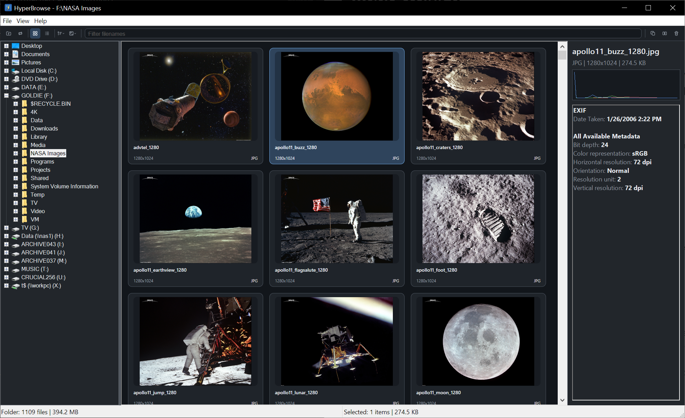

# HyperBrowse


[](https://buymeacoffee.com/theosopher)

HyperBrowse is a native Windows image browser and viewer focused on fast folder navigation, responsive thumbnail browsing, quick full-image viewing, and practical desktop workflows. It is intentionally a browser/viewer first, not a general-purpose editor.

## Main Window



## Highlights

- Native Win32 desktop application built with CMake and modern C++20.
- Direct2D and DirectWrite rendering in the browser and viewer, with per-monitor DPI awareness v2.
- Asynchronous folder enumeration, folder tree loading, metadata extraction, folder watching, and thumbnail scheduling.
- WIC baseline decode path, LibRaw-based RAW support, and optional nvJPEG acceleration with runtime fallback.
- Thumbnail and details modes, recursive browsing, sorting, in-folder filename filtering, and multi-selection workflows.
- Full-screen viewer with zoom, pan, rotate, info overlays, slideshow support, and adjacent-image prefetch.
- Portable and installer packaging outputs, plus a Windows GitHub Actions workflow for build verification.

## Current Capabilities

| Area | Included today |
| --- | --- |
| Browser | Explorer-style folder tree, resizable splitter, thumbnail mode, details mode, recursive browsing, live filename filter, compact layout toggle, thumbnail detail toggle, selected-item info strip |
| Viewer | Separate viewer window, full-screen open, zoom, pan, fit-to-window, 100% view, rotate, overlay HUD, slideshow, transition styles, multi-monitor open |
| Formats | JPEG, PNG, GIF, TIFF via WIC; RAW support for ARW, CR2, CR3, DNG, NEF, NRW, RAF, and RW2 via LibRaw |
| File workflows | Open, reveal in Explorer, open containing folder, copy path, copy/move/delete, EXIF-only JPEG orientation adjustment, batch convert to JPEG/PNG/TIFF |
| Performance pipeline | Prioritized thumbnail scheduling, memory-bounded thumbnail cache, metadata cache, viewer prefetch, folder watch refresh, optional GPU-assisted JPEG decode |
| Distribution | Debug and Release presets, smoke tests, portable layout, installer layout, zipped portable release, Inno Setup 6 installer with per-user or per-machine install mode |

## Architecture Overview

HyperBrowse is organized as a native desktop app with a shared core library and a small helper toolchain around it:

- `HyperBrowseCore` contains the browser, viewer, decode, render, service, and utility code shared by the app and the smoke tests.
- `HyperBrowse.exe` is the main Win32 desktop application.
- `HyperBrowseRawHelper.exe` provides the optional out-of-process RAW decode path.
- `HyperBrowseTests.exe` is the smoke and integration test harness.

The current implementation combines a Win32 shell with Direct2D and DirectWrite presentation, asynchronous services, and bounded in-memory caches. The main decode chain is:

1. nvJPEG for the optional accelerated JPEG path when available.
2. WIC for standard formats and safe fallback behavior.
3. LibRaw for supported RAW formats, either in-process or through the helper executable.

## Build Requirements

- Windows 10 or Windows 11, x64.
- Visual Studio 2022 with Desktop development for C++.
- CMake 3.23 or newer.
- PowerShell and Inno Setup 6 for release packaging.
- Optional internet access when `HYPERBROWSE_BUNDLE_CUDA_REDIST=ON`, because CMake downloads NVIDIA redistributables for packaging.

## Build

### Recommended: CMake presets

```powershell
cmake --preset vs2022-x64
cmake --build --preset debug
ctest --preset debug-tests
```

For a Release build:

```powershell
cmake --build --preset release
ctest --preset release-tests
```

### Visual Studio generator

```powershell
cmake -S . -B build -G "Visual Studio 17 2022" -A x64
cmake --build build --config Debug --target HyperBrowse
```

Launch the `HyperBrowse` startup project from Visual Studio, or run the built executable from the selected configuration output directory.

### Useful configure options

| Option | Default | Purpose |
| --- | --- | --- |
| `HYPERBROWSE_BUILD_TESTS` | `ON` | Build the smoke and integration test suite |
| `HYPERBROWSE_ENABLE_LIBRAW` | `ON` | Enable vendored LibRaw support and the RAW helper executable |
| `HYPERBROWSE_ENABLE_NVJPEG` | `ON` | Compile the optional nvJPEG acceleration path |
| `HYPERBROWSE_BUNDLE_CUDA_REDIST` | `ON` | Download and stage official NVIDIA runtime redistributables for packaging |
| `HYPERBROWSE_STATIC_MSVC_RUNTIME` | `ON` | Link the MSVC runtime statically to simplify deployment |
| `HYPERBROWSE_INNO_SETUP_COMPILER` | empty | Optional full path to `ISCC.exe` for the release packaging target |
| `HYPERBROWSE_WARNINGS_AS_ERRORS` | `OFF` | Promote compiler warnings to errors |

Examples:

```powershell
cmake --preset vs2022-x64 -DHYPERBROWSE_BUNDLE_CUDA_REDIST=OFF
cmake --preset vs2022-x64 -DHYPERBROWSE_ENABLE_NVJPEG=OFF
```

If nvJPEG is compiled in but the runtime is unavailable on the machine, HyperBrowse falls back to WIC automatically.

## Testing

Run the smoke suite through CTest:

```powershell
ctest --preset debug-tests
ctest --preset release-tests
```

The smoke coverage includes folder enumeration, folder tree enumeration, thumbnail scheduling and caching, WIC decode behavior, LibRaw decode behavior, metadata caching, file operations, batch convert cancellation, browser selection behavior, viewer interaction, and persisted UI state.

The repository also includes a GitHub Actions workflow at [.github/workflows/ci.yml](.github/workflows/ci.yml) that configures the project on `windows-latest`, builds the debug smoke target, runs the smoke executable, and builds the release application.

## Packaging

Create the portable layout after building:

```powershell
cmake --install build --config Release --component Portable --prefix build/dist/HyperBrowse-1.0.0-portable
```

Create the installer-friendly staging layout:

```powershell
cmake --install build --config Release --component Runtime --prefix build/dist/HyperBrowse-1.0.0-installer-layout
```

Create the full release artifact set, including a zipped portable package and an Inno Setup 6 installer:

```powershell
cmake --preset vs2022-x64-release-package
cmake --build --preset release-package
```

If you prefer the standalone packaging script, point it at the dedicated packaging build tree:

```powershell
powershell -ExecutionPolicy Bypass -NoProfile -File .\tools\PackageRelease.ps1 -BuildDir .\build-release-package
```

The dedicated release-packaging configure preset keeps the static MSVC runtime enabled, keeps LibRaw linked statically, and keeps CUDA redistributable bundling enabled so the portable zip and installer carry the RAW helper executable plus the nvJPEG runtime DLLs they need. The packaging target runs the release smoke tests, stages both install components under `build-release-package/dist/`, creates `HyperBrowse-<version>-portable-win64.zip`, and compiles `HyperBrowse-<version>-installer.exe` with Inno Setup 6.

The generated installer supports either current-user or all-users installation, writes the correct Add/Remove Programs entry for the selected scope, creates a Start Menu shortcut automatically, and offers an optional desktop shortcut.

When CUDA redistributable bundling is enabled, CMake downloads the official NVIDIA `cuda_cudart` and `libnvjpeg` redistributable archives, verifies their SHA256 hashes, and stages the runtime DLLs and license files beside the application. That keeps nvJPEG deployment self-contained instead of depending on a machine-wide CUDA install or `PATH` setup.

## Repository Layout

| Path | Purpose |
| --- | --- |
| `src/app` | Application entry point and lifecycle |
| `src/ui` | Main window shell, diagnostics UI, toolbar assets, dialogs |
| `src/browser` | Browser model and browser pane logic |
| `src/viewer` | Full-image viewer window and navigation |
| `src/services` | Async services for enumeration, watching, file ops, metadata, conversion, and scheduling |
| `src/decode` | WIC, nvJPEG, LibRaw, and RAW-helper decode paths |
| `src/render` | Direct2D and DirectWrite rendering helpers |
| `tests` | Smoke and integration-style test coverage |
| `specs` | Product, architecture, UX, performance, and roadmap documents |
| `tools` | Packaging scripts and development utilities |

## Project Documentation

The `specs/` directory tracks both design intent and implementation follow-up. Useful entry points:

- [specs/01-product-spec.md](specs/01-product-spec.md) for product scope and supported workflows.
- [specs/02-architecture.md](specs/02-architecture.md) for subsystem layout and pipeline design.
- [specs/04-ui-behavior.md](specs/04-ui-behavior.md) for the implemented UI contract.
- [specs/15-d2d-rendering-migration.md](specs/15-d2d-rendering-migration.md) for the rendering migration details.
- [specs/16-toolbar-ux-redesign.md](specs/16-toolbar-ux-redesign.md) for current toolbar implementation status.
- [specs/14-todo.md](specs/14-todo.md) and [specs/10-prioritized-enhancements.md](specs/10-prioritized-enhancements.md) for the current backlog.

## Current Scope Boundaries

HyperBrowse is already a capable browser/viewer, but it is still deliberately scoped. Current non-goals or deferred items include:

- Heavy image editing, annotations, cropping, and organizer-style database features.
- Drag-and-drop file operations between panes or instances.
- Multipage TIFF navigation and animated GIF thumbnails.
- Plugin ecosystems, duplicate finders, face detection, and library/database back ends.

If you want the current backlog in detail, start with [specs/14-todo.md](specs/14-todo.md).

## Version

Current release: **1.0.0**. The version is defined by the top-level `project(HyperBrowse VERSION ...)` call in [CMakeLists.txt](CMakeLists.txt) and flows into the generated build metadata, the Windows version resource, the About dialog, and all release artifact names (for example `HyperBrowse-1.0.0-portable-win64.zip` and `HyperBrowse-1.0.0-installer.exe`).

## License

HyperBrowse is released under the [MIT License](LICENSE).

Copyright (c) 2026 Michael A. McCloskey.

Third-party components retain their own licenses. Notable bundled components:

- [LibRaw](external/libraw) is dual-licensed under [LGPL 2.1](external/libraw/LICENSE.LGPL) and [CDDL 1.0](external/libraw/LICENSE.CDDL).
- [NanoSVG](external/nanosvg) is distributed under the [zlib license](external/nanosvg/LICENSE.txt).
- When CUDA redistributable bundling is enabled, NVIDIA CUDA Runtime and nvJPEG redistributables are governed by their respective NVIDIA Software License Agreements, staged beside the application as `NVIDIA-CUDA-RUNTIME-LICENSE.txt` and `NVIDIA-NVJPEG-LICENSE.txt`.

## Support the Project

If HyperBrowse is useful to you, you can support continued development:

[](https://buymeacoffee.com/theosopher)

Thank you!
